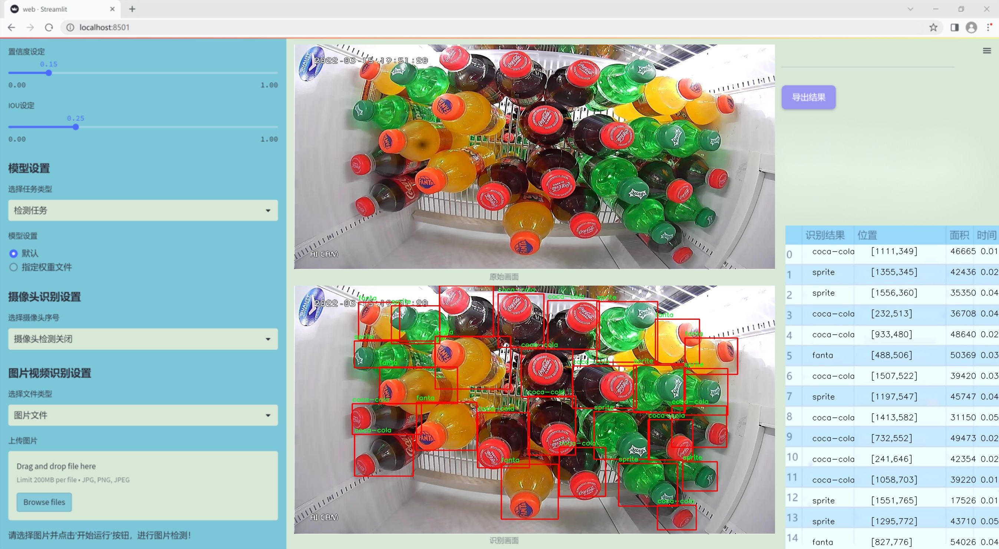
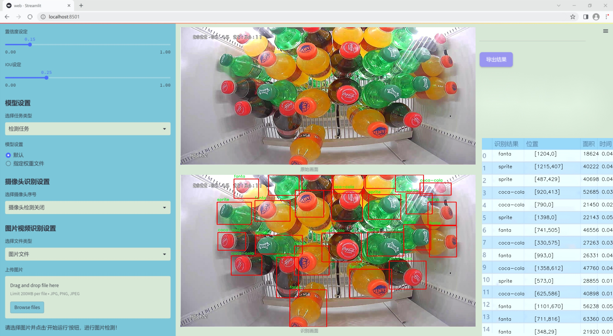
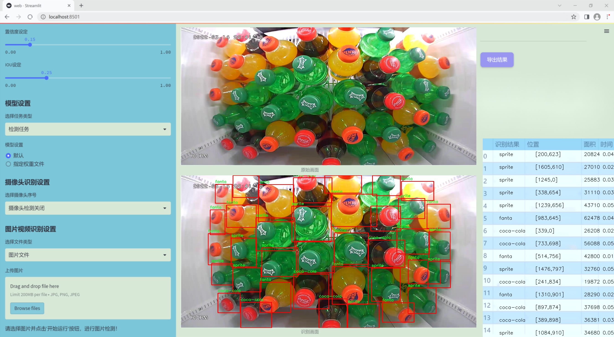
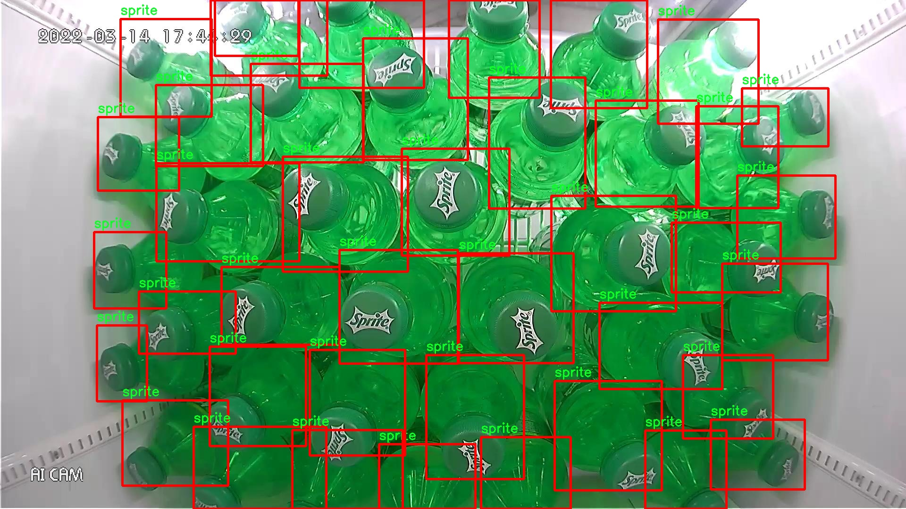
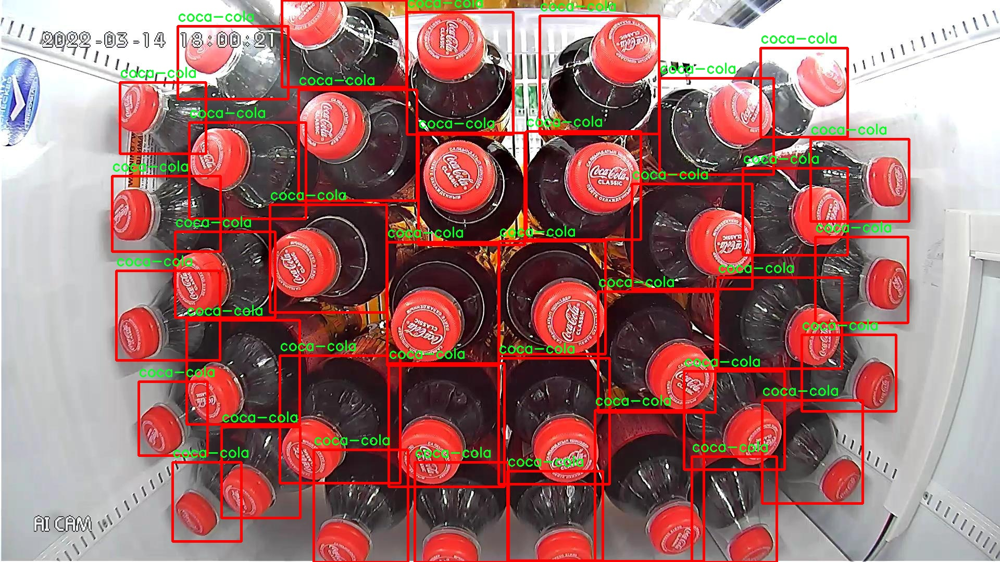
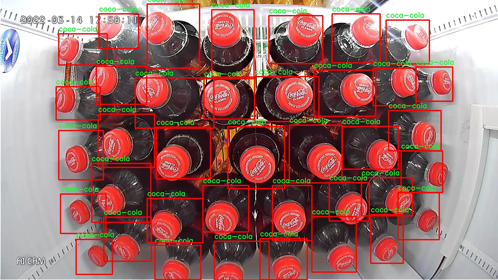
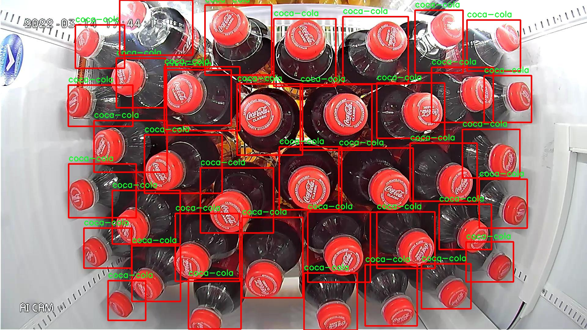
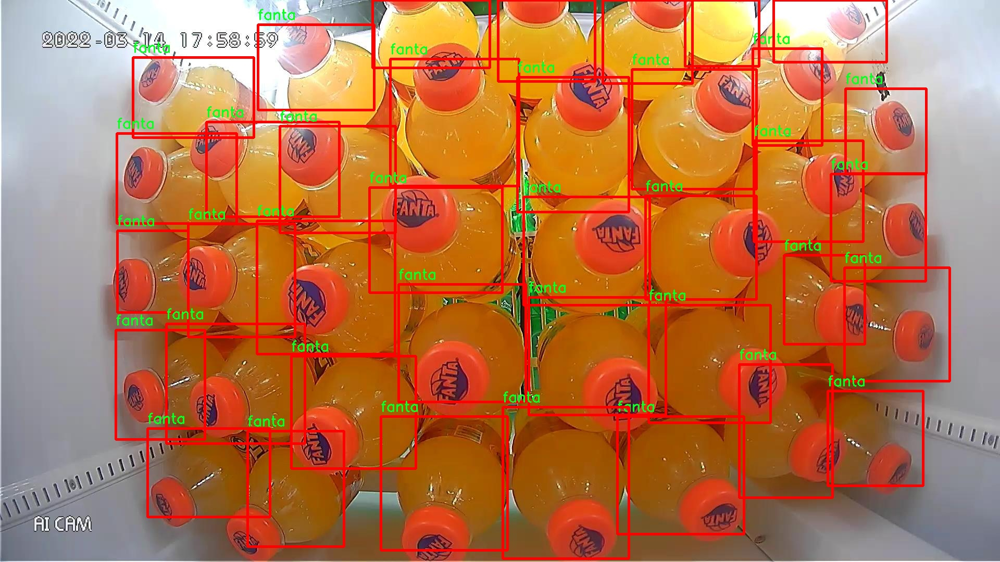

# 改进yolo11-FocusedLinearAttention等200+全套创新点大全：【无人零售】自动售卖机饮料检测系统源码＆数据集全套

### 1.图片效果展示







##### 项目来源 **[人工智能促进会 2024.11.03](https://kdocs.cn/l/cszuIiCKVNis)**

注意：由于项目一直在更新迭代，上面“1.图片效果展示”和“2.视频效果展示”展示的系统图片或者视频可能为老版本，新版本在老版本的基础上升级如下：（实际效果以升级的新版本为准）

  （1）适配了YOLOV11的“目标检测”模型和“实例分割”模型，通过加载相应的权重（.pt）文件即可自适应加载模型。

  （2）支持“图片识别”、“视频识别”、“摄像头实时识别”三种识别模式。

  （3）支持“图片识别”、“视频识别”、“摄像头实时识别”三种识别结果保存导出，解决手动导出（容易卡顿出现爆内存）存在的问题，识别完自动保存结果并导出到tempDir中。

  （4）支持Web前端系统中的标题、背景图等自定义修改。

  另外本项目提供训练的数据集和训练教程,暂不提供权重文件（best.pt）,需要您按照教程进行训练后实现图片演示和Web前端界面演示的效果。

### 2.视频效果展示

[2.1 视频效果展示](https://www.bilibili.com/video/BV1sjSmY3EQg/)

### 3.背景

研究背景与意义

随着科技的迅猛发展和消费者购物习惯的改变，无人零售逐渐成为现代商业的一种新兴模式。无人零售自动售卖机以其便捷性和高效性，受到了越来越多消费者的青睐。然而，自动售卖机在商品管理和库存监控方面仍面临诸多挑战，尤其是在饮料产品的实时检测与识别方面。为了解决这一问题，基于改进YOLOv11的饮料检测系统应运而生。

YOLO（You Only Look Once）系列模型以其快速且准确的目标检测能力而广泛应用于各种计算机视觉任务。YOLOv11作为该系列的最新版本，进一步提升了检测精度和速度，适合在资源有限的自动售卖机环境中进行实时处理。针对饮料产品的检测，研究团队选取了包含2200张图像的“soda bottles”数据集，数据集中涵盖了多种知名饮料品牌，如可口可乐、芬达和雪碧等。该数据集的单一类别特性，使得模型在训练过程中能够集中精力于特定对象的识别，从而提高检测的准确性。

本研究的意义在于，通过改进YOLOv11模型，构建一个高效的饮料检测系统，不仅能够实时监控自动售卖机内的饮料库存，还能通过数据分析优化补货策略，提升运营效率。此外，该系统的成功实施将为无人零售行业提供一种可行的技术解决方案，推动无人零售的进一步发展。同时，基于深度学习的目标检测技术在其他领域的应用也将得到启示，具有广泛的推广价值。通过本项目的研究，期望能够为无人零售行业的智能化转型提供坚实的技术支持。

### 4.数据集信息展示

##### 4.1 本项目数据集详细数据（类别数＆类别名）

nc: 3
names: ['coca-cola', 'fanta', 'sprite']


该项目为【目标检测】数据集，请在【训练教程和Web端加载模型教程（第三步）】这一步的时候按照【目标检测】部分的教程来训练

##### 4.2 本项目数据集信息介绍

本项目数据集信息介绍

本项目所使用的数据集名为“soda bottles”，专门用于训练和改进YOLOv11模型，以实现无人零售自动售卖机中的饮料检测系统。该数据集包含三种主要类别的饮料，分别是可口可乐（coca-cola）、芬达（fanta）和雪碧（sprite）。这些类别的选择不仅反映了市场上最受欢迎的饮料品牌，也为模型的训练提供了丰富的样本，确保其在实际应用中的准确性和可靠性。

数据集的构建过程经过精心设计，确保每个类别的样本数量均衡且多样化，以便模型能够有效学习到不同饮料的特征。数据集中包含了各种环境下的饮料图像，包括不同的光照条件、拍摄角度和背景，这些因素都可能影响模型的识别能力。因此，数据集中的图像涵盖了多种场景，以增强模型的泛化能力，确保其在实际应用中能够准确识别和分类。

此外，数据集还经过了详细的标注，每张图像中的饮料瓶都被精确框定，提供了必要的位置信息。这一过程不仅提高了数据集的质量，也为YOLOv11模型的训练提供了坚实的基础。通过使用“soda bottles”数据集，我们期望能够提升无人零售自动售卖机的饮料检测精度，从而优化消费者的购物体验，推动无人零售技术的发展。

综上所述，“soda bottles”数据集为本项目提供了丰富的训练素材和高质量的标注信息，确保了模型在实际应用中的有效性和准确性，为无人零售领域的创新与发展奠定了坚实的基础。











### 5.全套项目环境部署视频教程（零基础手把手教学）

[5.1 所需软件PyCharm和Anaconda安装教程（第一步）](https://www.bilibili.com/video/BV1BoC1YCEKi/?spm_id_from=333.999.0.0&vd_source=bc9aec86d164b67a7004b996143742dc)


[5.2 安装Python虚拟环境创建和依赖库安装视频教程（第二步）](https://www.bilibili.com/video/BV1ZoC1YCEBw?spm_id_from=333.788.videopod.sections&vd_source=bc9aec86d164b67a7004b996143742dc)

### 6.改进YOLOv11训练教程和Web_UI前端加载模型教程（零基础手把手教学）

[6.1 改进YOLOv11训练教程和Web_UI前端加载模型教程（第三步）](https://www.bilibili.com/video/BV1BoC1YCEhR?spm_id_from=333.788.videopod.sections&vd_source=bc9aec86d164b67a7004b996143742dc)


按照上面的训练视频教程链接加载项目提供的数据集，运行train.py即可开始训练



     Epoch   gpu_mem       box       obj       cls    labels  img_size
     1/200     20.8G   0.01576   0.01955  0.007536        22      1280: 100%|██████████| 849/849 [14:42<00:00,  1.04s/it]
               Class     Images     Labels          P          R     mAP@.5 mAP@.5:.95: 100%|██████████| 213/213 [01:14<00:00,  2.87it/s]
                 all       3395      17314      0.994      0.957      0.0957      0.0843

     Epoch   gpu_mem       box       obj       cls    labels  img_size
     2/200     20.8G   0.01578   0.01923  0.007006        22      1280: 100%|██████████| 849/849 [14:44<00:00,  1.04s/it]
               Class     Images     Labels          P          R     mAP@.5 mAP@.5:.95: 100%|██████████| 213/213 [01:12<00:00,  2.95it/s]
                 all       3395      17314      0.996      0.956      0.0957      0.0845

     Epoch   gpu_mem       box       obj       cls    labels  img_size
     3/200     20.8G   0.01561    0.0191  0.006895        27      1280: 100%|██████████| 849/849 [10:56<00:00,  1.29it/s]
               Class     Images     Labels          P          R     mAP@.5 mAP@.5:.95: 100%|███████   | 187/213 [00:52<00:00,  4.04it/s]
                 all       3395      17314      0.996      0.957      0.0957      0.0845


###### [项目数据集下载链接](https://kdocs.cn/l/cszuIiCKVNis)

### 7.原始YOLOv11算法讲解

##### YOLO11简介

> YOLO11源码地址：https://github.com/ultralytics/ultralytics

Ultralytics
YOLO11是一款尖端的、最先进的模型，它在之前YOLO版本成功的基础上进行了构建，并引入了新功能和改进，以进一步提升性能和灵活性。YOLO11设计快速、准确且易于使用，使其成为各种物体检测和跟踪、实例分割、图像分类以及姿态估计任务的绝佳选择。  


**YOLO11创新点如下:**

YOLO 11主要改进包括：  
`增强的特征提取`：YOLO 11采用了改进的骨干和颈部架构，增强了特征提取功能，以实现更精确的目标检测。  
`优化的效率和速度`：优化的架构设计和优化的训练管道提供更快的处理速度，同时保持准确性和性能之间的平衡。  
`更高的精度，更少的参数`：YOLO11m在COCO数据集上实现了更高的平均精度（mAP），参数比YOLOv8m少22%，使其在不影响精度的情况下提高了计算效率。  
`跨环境的适应性`：YOLO 11可以部署在各种环境中，包括边缘设备、云平台和支持NVIDIA GPU的系统。  
`广泛的支持任务`：YOLO 11支持各种计算机视觉任务，如对象检测、实例分割、图像分类、姿态估计和面向对象检测（OBB）。

**YOLO11不同模型尺寸信息：**

YOLO11 提供5种不同的型号规模模型，以满足不同的应用需求：

Model| size (pixels)| mAPval 50-95| Speed CPU ONNX (ms)| Speed T4 TensorRT10
(ms)| params (M)| FLOPs (B)  
---|---|---|---|---|---|---  
YOLO11n| 640| 39.5| 56.1 ± 0.8| 1.5 ± 0.0| 2.6| 6.5  
YOLO11s| 640| 47.0| 90.0 ± 1.2| 2.5 ± 0.0| 9.4| 21.5  
YOLO11m| 640| 51.5| 183.2 ± 2.0| 4.7 ± 0.1| 20.1| 68.0  
YOLO11l| 640| 53.4| 238.6 ± 1.4| 6.2 ± 0.1| 25.3| 86.9  
YOLO11x| 640| 54.7| 462.8 ± 6.7| 11.3 ± 0.2| 56.9| 194.9  
  
**模型常用训练超参数参数说明：**  
`YOLOv11
模型的训练设置包括训练过程中使用的各种超参数和配置`。这些设置会影响模型的性能、速度和准确性。关键的训练设置包括批量大小、学习率、动量和权重衰减。此外，优化器、损失函数和训练数据集组成的选择也会影响训练过程。对这些设置进行仔细的调整和实验对于优化性能至关重要。  
**以下是一些常用的模型训练参数和说明：**

参数名| 默认值| 说明  
---|---|---  
`model`| `None`| 指定用于训练的模型文件。接受指向 `.pt` 预训练模型或 `.yaml`
配置文件。对于定义模型结构或初始化权重至关重要。  
`data`| `None`| 数据集配置文件的路径（例如
`coco8.yaml`).该文件包含特定于数据集的参数，包括训练数据和验证数据的路径、类名和类数。  
`epochs`| `100`| 训练总轮数。每个epoch代表对整个数据集进行一次完整的训练。调整该值会影响训练时间和模型性能。  
`patience`| `100`| 在验证指标没有改善的情况下，提前停止训练所需的epoch数。当性能趋于平稳时停止训练，有助于防止过度拟合。  
`batch`| `16`| 批量大小，有三种模式:设置为整数(例如，’ Batch =16 ‘)， 60% GPU内存利用率的自动模式(’ Batch
=-1 ‘)，或指定利用率分数的自动模式(’ Batch =0.70 ')。  
`imgsz`| `640`| 用于训练的目标图像尺寸。所有图像在输入模型前都会被调整到这一尺寸。影响模型精度和计算复杂度。  
`device`| `None`| 指定用于训练的计算设备：单个 GPU (`device=0`）、多个 GPU (`device=0,1`)、CPU
(`device=cpu`)，或苹果芯片的 MPS (`device=mps`).  
`workers`| `8`| 加载数据的工作线程数（每 `RANK` 多 GPU 训练）。影响数据预处理和输入模型的速度，尤其适用于多 GPU 设置。  
`name`| `None`| 训练运行的名称。用于在项目文件夹内创建一个子目录，用于存储训练日志和输出结果。  
`pretrained`| `True`| 决定是否从预处理模型开始训练。可以是布尔值，也可以是加载权重的特定模型的字符串路径。提高训练效率和模型性能。  
`optimizer`| `'auto'`| 为训练模型选择优化器。选项包括 `SGD`, `Adam`, `AdamW`, `NAdam`,
`RAdam`, `RMSProp` 等，或 `auto` 用于根据模型配置进行自动选择。影响收敛速度和稳定性  
`lr0`| `0.01`| 初始学习率（即 `SGD=1E-2`, `Adam=1E-3`) .调整这个值对优化过程至关重要，会影响模型权重的更新速度。  
`lrf`| `0.01`| 最终学习率占初始学习率的百分比 = (`lr0 * lrf`)，与调度程序结合使用，随着时间的推移调整学习率。  


**各损失函数作用说明：**  
`定位损失box_loss`：预测框与标定框之间的误差（GIoU），越小定位得越准；  
`分类损失cls_loss`：计算锚框与对应的标定分类是否正确，越小分类得越准；  
`动态特征损失（dfl_loss）`：DFLLoss是一种用于回归预测框与目标框之间距离的损失函数。在计算损失时，目标框需要缩放到特征图尺度，即除以相应的stride，并与预测的边界框计算Ciou
Loss，同时与预测的anchors中心点到各边的距离计算回归DFLLoss。  


### 8.200+种全套改进YOLOV11创新点原理讲解

#### 8.1 200+种全套改进YOLOV11创新点原理讲解大全

由于篇幅限制，每个创新点的具体原理讲解就不全部展开，具体见下列网址中的改进模块对应项目的技术原理博客网址【Blog】（创新点均为模块化搭建，原理适配YOLOv5~YOLOv11等各种版本）

[改进模块技术原理博客【Blog】网址链接](https://gitee.com/qunmasj/good)


#### 8.2 精选部分改进YOLOV11创新点原理讲解

###### 这里节选部分改进创新点展开原理讲解(完整的改进原理见上图和[改进模块技术原理博客链接](https://gitee.com/qunmasj/good)【如果此小节的图加载失败可以通过CSDN或者Github搜索该博客的标题访问原始博客，原始博客图片显示正常】


### Context_Grided_Network(CGNet)简介
参考该博客提出的一种轻量化语义分割模型Context Grided Network(CGNet)，以满足设备的运行需要。

CGNet主要由CG块构建而成，CG块可以学习局部特征和周围环境上下文的联合特征，最后通过引入全局上下文特征进一步改善联合特征的学习。


 
下图给出了在Cityscapes数据集上对现有的一些语义分割模型的测试效果，横轴表示参数量，纵轴表示准确率(mIoU)。可以看出，在参数量较少的情况下，CGNet可以达到一个比较好的准确率。虽与高精度模型相去甚远，但在一些对精度要求不高、对实时性要求比较苛刻的情况下，很有价值。


高精度模型，如DeepLab、DFN、DenseASPP等，动不动就是几十M的参数，很难应用在移动设备上。而上图中红色的模型，相对内存占用较小，但它们的分割精度却不是很高。作者认为主要原因是，这些小网络大多遵循着分类网络的设计思路，并没有考虑语义分割任务更深层次的特点。

空间依赖性和上下文信息对提高分割精度有很大的作用。作者从该角度出发，提出了CG block，并进一步搭建了轻量级语义分割网络CGNet。CG块具有以下特点： 

学习局部特征和上下文特征的联合特征；
通过全局上下文特征改进上述联合特征；
可以贯穿应用在整个网络中，从low level（空间级别）到high level（语义级别）。不像PSPNet、DFN、DenseASPP等，只在编码阶段以后捕捉上下文特征。；
只有3个下采样，相比一般5个下采样的网络，能够更好地保留边缘信息。
CGNet遵循“深而薄”的原则设计，整个网络又51层构成。其中，为了降低计算，大量使用了channel-wise conv.

小型语义分割模型：

需要平衡准确率和系统开销
进化路线：ENet -> ICNet -> ESPNet
这些模型基本都基于分类网络设计，在分割准确率上效果并不是很好
上下文信息模型：

大多数现有模型只考虑解码阶段的上下文信息并且没有利用周围的上下文信息
注意力机制：

CG block使用全局上下文信息计算权重向量，并使用其细化局部特征和周围上下文特征的联合特征

#### Context Guided Block
CG block由4部分组成：


此外，CG block还采用了残差学习。文中提出了局部残差学习（LRL）和全局残差学习（GRL）两种方式。 LRL添加了从输入到联合特征提取器的连接，GRL添加了从输入到全局特征提取器的连接。从直观上来说，GRL比LRL更能促进网络中的信息传递（更像ResNet~~），后面实验部分也进行了测试，的确GRL更能提升分割精度。


CGNet的通用网络结构如下图所示，分为3个stage，第一个stage使用3个卷积层抽取特征，第二和第三个stage堆叠一定数量的CG block，具体个数可以根据情况调整。最后，通过1x1 conv得到分割结果。


下图是用于Cityscapes数据集的CGNet网络细节说明：输入尺寸为3*680*680；stage1连续使用了3个Conv-BN-PReLU组合，首个组合使用了stride=2的卷积，所以得到了1/2分辨率的feature map；stage2和stage3分别使用了多个CG block，且其中使用了不同大小的膨胀卷积核，最终分别得到了1/4和1/8的feature map。

需注意：

stage2&3的输入特征分别由其上一个stage的首个和最后一个block组合给出（参考上图的绿色箭头）；

输入注入机制，图中未体现，实际使用中，作者还将输入图像下采样1/4或1/8，分别给到stage2和stage3的输入中 ，以进一步加强特征传递。

channel-wise conv。为了缩减参数数量，在局部特征提取器和周围上下文特征提取器中使用了channel-wise卷积，可以消除跨通道的计算成本，同时节省内存占用。但是，没有像MobileNet等模型一样，在depth-wise卷积后面接point-wise卷积（1*1 conv），作者解释是，因为CG block需要保持局部特征和周围上下文特征的独立性，而1*1 conv会破坏这种独立性，所以效果欠佳，实验部分也进行了验证。

个人感觉此处应该指的是depth-wise卷积？

官方Git中对该部分的实现如下：


### 9.系统功能展示

图9.1.系统支持检测结果表格显示

  图9.2.系统支持置信度和IOU阈值手动调节

  图9.3.系统支持自定义加载权重文件best.pt(需要你通过步骤5中训练获得)

  图9.4.系统支持摄像头实时识别

  图9.5.系统支持图片识别

  图9.6.系统支持视频识别

  图9.7.系统支持识别结果文件自动保存

  图9.8.系统支持Excel导出检测结果数据


### 10. YOLOv11核心改进源码讲解

#### 10.1 kan_conv.py

以下是对代码的核心部分进行提炼和详细注释的结果：

```python
import torch
import torch.nn as nn

class KANConvNDLayer(nn.Module):
    def __init__(self, conv_class, norm_class, input_dim, output_dim, spline_order, kernel_size,
                 groups=1, padding=0, stride=1, dilation=1,
                 ndim: int = 2, grid_size=5, base_activation=nn.GELU, grid_range=[-1, 1], dropout=0.0):
        super(KANConvNDLayer, self).__init__()
        
        # 初始化参数
        self.inputdim = input_dim  # 输入维度
        self.outdim = output_dim    # 输出维度
        self.spline_order = spline_order  # 样条的阶数
        self.kernel_size = kernel_size  # 卷积核大小
        self.padding = padding  # 填充
        self.stride = stride  # 步幅
        self.dilation = dilation  # 膨胀
        self.groups = groups  # 分组数
        self.ndim = ndim  # 维度（1D, 2D, 3D）
        self.grid_size = grid_size  # 网格大小
        self.base_activation = base_activation()  # 基础激活函数
        self.grid_range = grid_range  # 网格范围

        # 初始化dropout层
        self.dropout = None
        if dropout > 0:
            if ndim == 1:
                self.dropout = nn.Dropout1d(p=dropout)
            elif ndim == 2:
                self.dropout = nn.Dropout2d(p=dropout)
            elif ndim == 3:
                self.dropout = nn.Dropout3d(p=dropout)

        # 检查分组参数的有效性
        if groups <= 0:
            raise ValueError('groups must be a positive integer')
        if input_dim % groups != 0:
            raise ValueError('input_dim must be divisible by groups')
        if output_dim % groups != 0:
            raise ValueError('output_dim must be divisible by groups')

        # 初始化基础卷积层
        self.base_conv = nn.ModuleList([conv_class(input_dim // groups,
                                                   output_dim // groups,
                                                   kernel_size,
                                                   stride,
                                                   padding,
                                                   dilation,
                                                   groups=1,
                                                   bias=False) for _ in range(groups)])

        # 初始化样条卷积层
        self.spline_conv = nn.ModuleList([conv_class((grid_size + spline_order) * input_dim // groups,
                                                     output_dim // groups,
                                                     kernel_size,
                                                     stride,
                                                     padding,
                                                     dilation,
                                                     groups=1,
                                                     bias=False) for _ in range(groups)])

        # 初始化归一化层
        self.layer_norm = nn.ModuleList([norm_class(output_dim // groups) for _ in range(groups)])

        # 初始化PReLU激活函数
        self.prelus = nn.ModuleList([nn.PReLU() for _ in range(groups)])

        # 生成样条网格
        h = (self.grid_range[1] - self.grid_range[0]) / grid_size
        self.grid = torch.linspace(
            self.grid_range[0] - h * spline_order,
            self.grid_range[1] + h * spline_order,
            grid_size + 2 * spline_order + 1,
            dtype=torch.float32
        )

        # 使用Kaiming均匀分布初始化卷积层权重
        for conv_layer in self.base_conv:
            nn.init.kaiming_uniform_(conv_layer.weight, nonlinearity='linear')

        for conv_layer in self.spline_conv:
            nn.init.kaiming_uniform_(conv_layer.weight, nonlinearity='linear')

    def forward_kan(self, x, group_index):
        # 基础卷积的前向传播
        base_output = self.base_conv[group_index](self.base_activation(x))

        # 扩展输入维度以进行样条操作
        x_uns = x.unsqueeze(-1)
        target = x.shape[1:] + self.grid.shape
        grid = self.grid.view(*list([1 for _ in range(self.ndim + 1)] + [-1, ])).expand(target).contiguous().to(x.device)

        # 计算样条基
        bases = ((x_uns >= grid[..., :-1]) & (x_uns < grid[..., 1:])).to(x.dtype)

        # 计算多阶样条基
        for k in range(1, self.spline_order + 1):
            left_intervals = grid[..., :-(k + 1)]
            right_intervals = grid[..., k:-1]
            delta = torch.where(right_intervals == left_intervals, torch.ones_like(right_intervals),
                                right_intervals - left_intervals)
            bases = ((x_uns - left_intervals) / delta * bases[..., :-1]) + \
                    ((grid[..., k + 1:] - x_uns) / (grid[..., k + 1:] - grid[..., 1:(-k)]) * bases[..., 1:])
        bases = bases.contiguous()
        bases = bases.moveaxis(-1, 2).flatten(1, 2)

        # 通过样条卷积层进行前向传播
        spline_output = self.spline_conv[group_index](bases)
        x = self.prelus[group_index](self.layer_norm[group_index](base_output + spline_output))

        # 应用dropout
        if self.dropout is not None:
            x = self.dropout(x)

        return x

    def forward(self, x):
        # 将输入按组分割并进行前向传播
        split_x = torch.split(x, self.inputdim // self.groups, dim=1)
        output = []
        for group_ind, _x in enumerate(split_x):
            y = self.forward_kan(_x.clone(), group_ind)
            output.append(y.clone())
        y = torch.cat(output, dim=1)  # 合并输出
        return y

# KANConv3DLayer, KANConv2DLayer, KANConv1DLayer 类分别继承自 KANConvNDLayer
# 这些类的构造函数只需传入相应的卷积和归一化类
class KANConv3DLayer(KANConvNDLayer):
    def __init__(self, input_dim, output_dim, kernel_size, spline_order=3, groups=1, padding=0, stride=1, dilation=1,
                 grid_size=5, base_activation=nn.GELU, grid_range=[-1, 1], dropout=0.0):
        super(KANConv3DLayer, self).__init__(nn.Conv3d, nn.InstanceNorm3d,
                                             input_dim, output_dim,
                                             spline_order, kernel_size,
                                             groups=groups, padding=padding, stride=stride, dilation=dilation,
                                             ndim=3,
                                             grid_size=grid_size, base_activation=base_activation,
                                             grid_range=grid_range, dropout=dropout)

class KANConv2DLayer(KANConvNDLayer):
    def __init__(self, input_dim, output_dim, kernel_size, spline_order=3, groups=1, padding=0, stride=1, dilation=1,
                 grid_size=5, base_activation=nn.GELU, grid_range=[-1, 1], dropout=0.0):
        super(KANConv2DLayer, self).__init__(nn.Conv2d, nn.InstanceNorm2d,
                                             input_dim, output_dim,
                                             spline_order, kernel_size,
                                             groups=groups, padding=padding, stride=stride, dilation=dilation,
                                             ndim=2,
                                             grid_size=grid_size, base_activation=base_activation,
                                             grid_range=grid_range, dropout=dropout)

class KANConv1DLayer(KANConvNDLayer):
    def __init__(self, input_dim, output_dim, kernel_size, spline_order=3, groups=1, padding=0, stride=1, dilation=1,
                 grid_size=5, base_activation=nn.GELU, grid_range=[-1, 1], dropout=0.0):
        super(KANConv1DLayer, self).__init__(nn.Conv1d, nn.InstanceNorm1d,
                                             input_dim, output_dim,
                                             spline_order, kernel_size,
                                             groups=groups, padding=padding, stride=stride, dilation=dilation,
                                             ndim=1,
                                             grid_size=grid_size, base_activation=base_activation,
                                             grid_range=grid_range, dropout=dropout)
```

### 代码核心部分说明：
1. **KANConvNDLayer**: 这是一个通用的N维卷积层，支持1D、2D和3D卷积。它结合了基础卷积和样条卷积，并提供了归一化和激活功能。
2. **forward_kan**: 这个方法实现了卷积层的前向传播，包括基础卷积和样条卷积的计算。
3. **网格生成**: 在初始化时生成样条网格，用于后续的样条基计算。
4. **分组卷积**: 支持分组卷积，允许在多个组上并行处理输入。
5. **子类**: `KANConv3DLayer`、`KANConv2DLayer`和`KANConv1DLayer`分别针对3D、2D和1D卷积的具体实现，简化了构造函数的调用。

通过这些核心部分，用户可以构建复杂的卷积神经网络，利用样条卷积的优势来提高模型的表现。

这个文件定义了一个名为 `KANConvNDLayer` 的神经网络层，主要用于实现一种基于样条（spline）插值的卷积操作。该层支持多维输入（如1D、2D、3D），并且可以根据需要进行分组卷积。下面是对代码的逐步解析。

首先，`KANConvNDLayer` 类继承自 `torch.nn.Module`，构造函数接受多个参数，包括卷积类型、归一化类型、输入和输出维度、样条的阶数、卷积核大小、分组数、填充、步幅、扩张率、维度数量、网格大小、激活函数、网格范围和丢弃率等。构造函数中，首先对这些参数进行初始化，并检查一些有效性条件，比如分组数必须为正且输入和输出维度必须能被分组数整除。

接下来，类中定义了几个重要的模块列表：`base_conv` 和 `spline_conv` 分别用于基础卷积和样条卷积，这些卷积层是通过 `conv_class` 创建的。`layer_norm` 列表用于对每个分组的输出进行归一化，`prelus` 列表则包含了 PReLU 激活函数。网格（grid）用于样条插值的计算，初始化时根据给定的范围和大小生成。

在 `forward_kan` 方法中，首先对输入进行基础激活处理，然后通过基础卷积层进行线性变换。接着，输入的维度被扩展，以便进行样条操作。样条基函数的计算涉及到输入值与网格的比较，并通过多个阶数的样条进行插值计算。最终，样条卷积的输出与基础卷积的输出相加，经过归一化和激活函数处理后，如果设置了丢弃率，则应用丢弃层。

`forward` 方法则是将输入按照分组进行切分，并对每个分组调用 `forward_kan` 方法进行处理，最后将所有分组的输出拼接在一起。

此外，文件中还定义了三个子类：`KANConv3DLayer`、`KANConv2DLayer` 和 `KANConv1DLayer`，分别对应于三维、二维和一维卷积。这些子类通过调用父类的构造函数，指定相应的卷积和归一化类型。

整体来看，这个文件实现了一种灵活且强大的卷积层，结合了样条插值和深度学习中的卷积操作，适用于多种维度的数据处理任务。

#### 10.2 predict.py

以下是代码中最核心的部分，并附上详细的中文注释：

```python
from ultralytics.engine.predictor import BasePredictor
from ultralytics.engine.results import Results
from ultralytics.utils import ops

class DetectionPredictor(BasePredictor):
    """
    DetectionPredictor类，继承自BasePredictor类，用于基于检测模型进行预测。
    """

    def postprocess(self, preds, img, orig_imgs):
        """对预测结果进行后处理，并返回Results对象的列表。"""
        
        # 使用非极大值抑制（NMS）来过滤预测框
        preds = ops.non_max_suppression(
            preds,  # 预测框
            self.args.conf,  # 置信度阈值
            self.args.iou,  # IOU阈值
            agnostic=self.args.agnostic_nms,  # 是否进行类别无关的NMS
            max_det=self.args.max_det,  # 最大检测框数量
            classes=self.args.classes,  # 需要检测的类别
        )

        # 如果输入的原始图像不是列表，则将其转换为numpy数组
        if not isinstance(orig_imgs, list):  # 输入图像是torch.Tensor，而不是列表
            orig_imgs = ops.convert_torch2numpy_batch(orig_imgs)  # 转换为numpy数组

        results = []  # 初始化结果列表
        for i, pred in enumerate(preds):  # 遍历每个预测结果
            orig_img = orig_imgs[i]  # 获取对应的原始图像
            # 将预测框的坐标从缩放后的图像尺寸转换为原始图像尺寸
            pred[:, :4] = ops.scale_boxes(img.shape[2:], pred[:, :4], orig_img.shape)
            img_path = self.batch[0][i]  # 获取图像路径
            # 将结果添加到结果列表中
            results.append(Results(orig_img, path=img_path, names=self.model.names, boxes=pred))
        
        return results  # 返回处理后的结果列表
```

### 代码注释说明：
1. **导入模块**：导入必要的模块和类，以便进行预测和结果处理。
2. **DetectionPredictor类**：该类专门用于处理检测模型的预测，继承自`BasePredictor`。
3. **postprocess方法**：该方法负责对模型的预测结果进行后处理，包括应用非极大值抑制（NMS）和调整预测框的坐标。
4. **非极大值抑制**：通过`ops.non_max_suppression`函数来减少重叠的预测框，只保留最有可能的框。
5. **图像转换**：如果原始图像不是列表格式，则将其转换为numpy数组，以便后续处理。
6. **结果构建**：遍历每个预测结果，调整框的坐标，并将每个结果封装成`Results`对象，最终返回所有结果的列表。

这个程序文件 `predict.py` 是一个用于目标检测的预测模块，基于 Ultralytics YOLO（You Only Look Once）模型构建。文件中定义了一个名为 `DetectionPredictor` 的类，该类继承自 `BasePredictor`，用于处理目标检测模型的预测。

在类的文档字符串中，提供了一个使用示例，展示了如何从 `ultralytics.utils` 导入必要的模块，并创建一个 `DetectionPredictor` 实例。示例中，模型文件 `yolov8n.pt` 和数据源 `ASSETS` 被传递给 `DetectionPredictor`，然后调用 `predict_cli()` 方法进行预测。

类中定义了一个名为 `postprocess` 的方法，该方法用于对模型的预测结果进行后处理。具体来说，它接受三个参数：`preds`（模型的预测结果）、`img`（输入图像）和 `orig_imgs`（原始图像）。在方法内部，首先调用 `ops.non_max_suppression` 函数对预测结果进行非极大值抑制，以减少冗余的检测框。这个过程使用了一些参数，如置信度阈值、IOU（Intersection over Union）阈值、是否进行类别无关的非极大值抑制、最大检测框数量以及需要检测的类别。

接下来，方法检查 `orig_imgs` 是否为列表。如果不是，说明输入图像是一个 PyTorch 张量，此时调用 `ops.convert_torch2numpy_batch` 将其转换为 NumPy 数组格式。

然后，方法会遍历每个预测结果，调整检测框的坐标，使其适应原始图像的尺寸。具体地，使用 `ops.scale_boxes` 函数来缩放检测框的坐标。每个预测结果和对应的原始图像路径会被封装成 `Results` 对象，并添加到结果列表中。

最后，`postprocess` 方法返回一个包含所有处理后结果的列表。这个类和方法的设计使得用户能够方便地对目标检测模型的输出进行处理，并提取出有用的信息。

#### 10.3 test_selective_scan_speed.py

以下是代码中最核心的部分，并附上详细的中文注释：

```python
import torch
import torch.nn.functional as F

def build_selective_scan_fn(selective_scan_cuda: object = None, mode="mamba_ssm", tag=None):
    """
    构建选择性扫描函数的工厂函数。
    
    参数:
    selective_scan_cuda: CUDA实现的选择性扫描函数
    mode: 模式选择
    tag: 标签，用于标识不同的选择性扫描实现
    """
    
    class SelectiveScanFn(torch.autograd.Function):
        @staticmethod
        def forward(ctx, u, delta, A, B, C, D=None, z=None, delta_bias=None, delta_softplus=False, return_last_state=False, nrows=1, backnrows=-1):
            """
            前向传播函数，执行选择性扫描操作。
            
            参数:
            ctx: 上下文对象，用于保存状态
            u: 输入张量
            delta: 增量张量
            A, B, C: 权重张量
            D: 可选的偏置张量
            z: 可选的张量
            delta_bias: 可选的增量偏置
            delta_softplus: 是否应用softplus激活
            return_last_state: 是否返回最后状态
            nrows: 行数
            backnrows: 回溯行数
            
            返回:
            输出张量或输出张量和最后状态的元组
            """
            # 确保输入张量是连续的
            if u.stride(-1) != 1:
                u = u.contiguous()
            if delta.stride(-1) != 1:
                delta = delta.contiguous()
            if D is not None:
                D = D.contiguous()
            if B.stride(-1) != 1:
                B = B.contiguous()
            if C.stride(-1) != 1:
                C = C.contiguous()
            if z is not None and z.stride(-1) != 1:
                z = z.contiguous()

            # 处理张量的维度和形状
            if B.dim() == 3:
                B = rearrange(B, "b dstate l -> b 1 dstate l")
                ctx.squeeze_B = True
            if C.dim() == 3:
                C = rearrange(C, "b dstate l -> b 1 dstate l")
                ctx.squeeze_C = True

            # 检查输入形状的有效性
            assert u.shape[1] % (B.shape[1] * nrows) == 0 
            assert nrows in [1, 2, 3, 4]  # 限制行数为1到4

            if backnrows > 0:
                assert u.shape[1] % (B.shape[1] * backnrows) == 0 
                assert backnrows in [1, 2, 3, 4]  # 限制回溯行数为1到4
            else:
                backnrows = nrows
            ctx.backnrows = backnrows
            
            # 调用CUDA实现的选择性扫描前向函数
            if mode in ["mamba_ssm"]:
                out, x, *rest = selective_scan_cuda.fwd(u, delta, A, B, C, D, z, delta_bias, delta_softplus)
            else:
                raise NotImplementedError

            # 保存状态以便反向传播
            ctx.delta_softplus = delta_softplus
            ctx.has_z = z is not None
            last_state = x[:, :, -1, 1::2]  # 获取最后状态
            
            # 返回输出或输出和最后状态
            ctx.save_for_backward(u, delta, A, B, C, D, delta_bias, x)
            return out if not return_last_state else (out, last_state)

        @staticmethod
        def backward(ctx, dout, *args):
            """
            反向传播函数，计算梯度。
            
            参数:
            ctx: 上下文对象
            dout: 输出的梯度
            
            返回:
            输入张量的梯度
            """
            u, delta, A, B, C, D, delta_bias, x = ctx.saved_tensors
            
            # 调用CUDA实现的选择性扫描反向函数
            du, ddelta, dA, dB, dC, dD, ddelta_bias, *rest = selective_scan_cuda.bwd(
                u, delta, A, B, C, D, delta_bias, dout, x, ctx.delta_softplus, ctx.backnrows
            )
            
            return (du, ddelta, dA, dB, dC, dD if D is not None else None, None, ddelta_bias if delta_bias is not None else None)

    def selective_scan_fn(u, delta, A, B, C, D=None, z=None, delta_bias=None, delta_softplus=False, return_last_state=False, nrows=1, backnrows=-1):
        """
        封装选择性扫描函数的调用。
        """
        return SelectiveScanFn.apply(u, delta, A, B, C, D, z, delta_bias, delta_softplus, return_last_state, nrows, backnrows)

    return selective_scan_fn
```

### 代码说明：
1. **导入必要的库**：导入了PyTorch和其功能模块。
2. **`build_selective_scan_fn`函数**：构建选择性扫描函数的工厂函数，接收CUDA实现和模式作为参数。
3. **`SelectiveScanFn`类**：继承自`torch.autograd.Function`，实现了前向和反向传播的方法。
   - **`forward`方法**：执行选择性扫描的前向计算，处理输入张量的形状和连续性，调用CUDA实现的前向函数，并保存必要的状态以供反向传播使用。
   - **`backward`方法**：计算梯度，调用CUDA实现的反向函数，并返回输入张量的梯度。
4. **`selective_scan_fn`函数**：封装了对`SelectiveScanFn`的调用，提供了一个简单的接口。

该代码实现了选择性扫描的前向和反向传播功能，适用于深度学习中的动态计算图。

这个程序文件 `test_selective_scan_speed.py` 是一个用于测试选择性扫描（Selective Scan）算法性能的脚本，主要依赖于 PyTorch 库进行深度学习计算。代码中包含了选择性扫描的前向和反向传播实现，以及对不同实现的性能测试。

首先，文件导入了必要的库，包括 `torch`、`torch.nn.functional`、`pytest`、`time` 等。接着，定义了一个构建选择性扫描函数的工厂函数 `build_selective_scan_fn`，该函数接收一个 CUDA 实现的选择性扫描函数和其他参数，返回一个自定义的 PyTorch 函数 `selective_scan_fn`。这个函数内部定义了一个 `SelectiveScanFn` 类，继承自 `torch.autograd.Function`，实现了前向传播和反向传播的方法。

在 `SelectiveScanFn` 的 `forward` 方法中，首先对输入张量进行处理，确保它们是连续的，并根据需要调整维度。接着，依据不同的模式（如 `mamba_ssm`、`sscore` 等）调用相应的 CUDA 实现进行前向计算。最后，保存必要的中间结果以供反向传播使用，并返回输出结果。

`backward` 方法则实现了反向传播的逻辑，计算梯度并返回给定的输入张量的梯度。

文件中还定义了几个选择性扫描的参考实现函数 `selective_scan_ref`、`selective_scan_easy` 和 `selective_scan_easy_v2`，这些函数实现了选择性扫描的核心算法，支持不同的输入格式和参数设置。

在 `test_speed` 函数中，设置了一系列参数，包括数据类型、序列长度、批量大小等。接着，生成了测试所需的随机输入数据，并使用不同的选择性扫描实现进行性能测试。通过记录每个实现的运行时间，比较它们的性能。

最后，程序调用 `test_speed` 函数开始性能测试，并输出每个实现的前向和前向反向计算的时间。这种测试可以帮助开发者了解不同实现的效率，并在实际应用中选择最佳的实现方案。

#### 10.4 kacn_conv.py

以下是代码中最核心的部分，并附上详细的中文注释：

```python
import torch
import torch.nn as nn

class KACNConvNDLayer(nn.Module):
    def __init__(self, conv_class, norm_class, input_dim, output_dim, degree, kernel_size,
                 groups=1, padding=0, stride=1, dilation=1,
                 ndim: int = 2, dropout=0.0):
        super(KACNConvNDLayer, self).__init__()
        
        # 初始化参数
        self.inputdim = input_dim  # 输入维度
        self.outdim = output_dim    # 输出维度
        self.degree = degree         # 多项式的度数
        self.kernel_size = kernel_size  # 卷积核大小
        self.padding = padding       # 填充
        self.stride = stride         # 步幅
        self.dilation = dilation     # 膨胀
        self.groups = groups         # 分组卷积的组数
        self.ndim = ndim             # 数据的维度（1D, 2D, 3D）
        self.dropout = None          # Dropout层

        # 根据维度选择合适的Dropout层
        if dropout > 0:
            if ndim == 1:
                self.dropout = nn.Dropout1d(p=dropout)
            elif ndim == 2:
                self.dropout = nn.Dropout2d(p=dropout)
            elif ndim == 3:
                self.dropout = nn.Dropout3d(p=dropout)

        # 检查分组参数的有效性
        if groups <= 0:
            raise ValueError('groups must be a positive integer')
        if input_dim % groups != 0:
            raise ValueError('input_dim must be divisible by groups')
        if output_dim % groups != 0:
            raise ValueError('output_dim must be divisible by groups')

        # 创建归一化层
        self.layer_norm = nn.ModuleList([norm_class(output_dim // groups) for _ in range(groups)])

        # 创建多项式卷积层
        self.poly_conv = nn.ModuleList([conv_class((degree + 1) * input_dim // groups,
                                                   output_dim // groups,
                                                   kernel_size,
                                                   stride,
                                                   padding,
                                                   dilation,
                                                   groups=1,
                                                   bias=False) for _ in range(groups)])
        
        # 创建一个缓冲区，用于存储多项式的系数
        arange_buffer_size = (1, 1, -1,) + tuple(1 for _ in range(ndim))
        self.register_buffer("arange", torch.arange(0, degree + 1, 1).view(*arange_buffer_size))
        
        # 使用Kaiming均匀分布初始化卷积层的权重
        for conv_layer in self.poly_conv:
            nn.init.normal_(conv_layer.weight, mean=0.0, std=1 / (input_dim * (degree + 1) * kernel_size ** ndim))

    def forward_kacn(self, x, group_index):
        # 前向传播，处理每个组的输入
        x = torch.tanh(x)  # 应用tanh激活函数
        x = x.acos().unsqueeze(2)  # 计算反余弦并增加一个维度
        x = (x * self.arange).flatten(1, 2)  # 乘以多项式系数并展平
        x = x.cos()  # 计算余弦
        x = self.poly_conv[group_index](x)  # 通过对应的卷积层
        x = self.layer_norm[group_index](x)  # 归一化
        if self.dropout is not None:
            x = self.dropout(x)  # 应用Dropout
        return x

    def forward(self, x):
        # 前向传播，处理整个输入
        split_x = torch.split(x, self.inputdim // self.groups, dim=1)  # 按组分割输入
        output = []
        for group_ind, _x in enumerate(split_x):
            y = self.forward_kacn(_x.clone(), group_ind)  # 对每个组调用forward_kacn
            output.append(y.clone())  # 收集输出
        y = torch.cat(output, dim=1)  # 合并所有组的输出
        return y
```

### 代码核心部分说明：
1. **KACNConvNDLayer类**：这是一个自定义的卷积层，支持多维卷积（1D、2D、3D），并结合了多项式卷积和归一化。
2. **初始化方法**：初始化卷积层、归一化层和Dropout层，并进行参数有效性检查。
3. **forward_kacn方法**：实现了对输入的前向传播，包含了激活函数、卷积和归一化等操作。
4. **forward方法**：处理整个输入，将其分割为多个组，并对每个组调用`forward_kacn`进行处理，最后合并输出。

这个程序文件定义了一个名为 `kacn_conv.py` 的模块，主要实现了一个新的卷积层 `KACNConvNDLayer` 及其针对不同维度的特化版本（1D、2D 和 3D）。该模块使用 PyTorch 框架构建深度学习模型。

首先，`KACNConvNDLayer` 类是一个自定义的神经网络层，继承自 `nn.Module`。在初始化方法中，用户可以传入卷积类、归一化类、输入和输出维度、卷积的次数（degree）、卷积核大小等参数。该类还支持分组卷积（groups）、填充（padding）、步幅（stride）、扩张（dilation）以及 dropout 的设置。初始化过程中，程序会检查分组数是否为正整数，并确保输入和输出维度可以被分组数整除。

在初始化时，`KACNConvNDLayer` 会创建多个卷积层和归一化层的实例，存储在 `ModuleList` 中，以便后续使用。卷积层的权重会使用 Kaiming 正态分布进行初始化，以便于模型的训练。

`forward_kacn` 方法实现了该层的前向传播逻辑。首先对输入进行非线性激活（使用双曲正切函数），然后通过反余弦函数处理，并进行维度变换。接着，使用指定的卷积层对处理后的数据进行卷积操作，并应用归一化层。若设置了 dropout，则会在此处应用。

`forward` 方法负责处理输入数据，首先将输入按照分组进行拆分，然后对每个分组调用 `forward_kacn` 方法进行处理，最后将所有分组的输出拼接在一起，形成最终的输出。

接下来，`KACNConv3DLayer`、`KACNConv2DLayer` 和 `KACNConv1DLayer` 类分别是 `KACNConvNDLayer` 的特化版本，分别用于处理三维、二维和一维的卷积操作。它们在初始化时调用父类的构造函数，并传入相应的卷积和归一化类（如 `nn.Conv3d`、`nn.Conv2d` 和 `nn.Conv1d`）以及其他参数。

总体而言，这个模块实现了一个灵活且可扩展的卷积层设计，支持多种维度的卷积操作，并结合了归一化和 dropout 机制，适用于构建复杂的深度学习模型。

注意：由于此博客编辑较早，上面“10.YOLOv11核心改进源码讲解”中部分代码可能会优化升级，仅供参考学习，以“11.完整训练+Web前端界面+200+种全套创新点源码、数据集获取”的内容为准。

### 11.完整训练+Web前端界面+200+种全套创新点源码、数据集获取


# [下载链接：https://mbd.pub/o/bread/Z5WWmJ9w](https://mbd.pub/o/bread/Z5WWmJ9w)